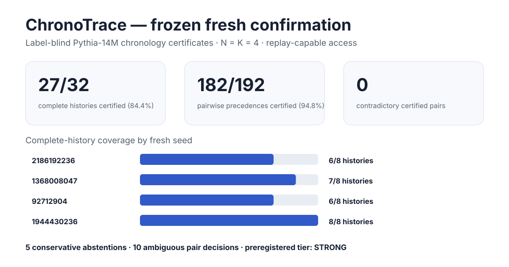

# ChronoTrace

[](https://github.com/Null-Square/chronotrace/actions/workflows/ci.yml)
[](https://github.com/Null-Square/chronotrace/actions/workflows/paper.yml)

**Certified reconstruction of training chronology from noncommutative learning interactions.**

ChronoTrace studies an inverse problem in sequential learning:

> Given a finished model, a known base checkpoint, candidate learning stages, and a replay-capable training operator, which stage-order claims can be **certified** from the endpoint?

The project does **not** claim that training order matters—that is already known. The contribution is an inverse, proof-oriented formulation: reconstruct or constrain an **unknown chronology** using exact ordered interactions and conservative certificates that may abstain when the evidence is insufficient.

## Frozen headline result

The final fresh Pythia-14M confirmation is frozen in
[`configs/chronotrace_pairwise_multi_witness_confirmation_v3.selection.json`](configs/chronotrace_pairwise_multi_witness_confirmation_v3.selection.json).



| Metric | Frozen result |
| --- | ---: |
| Fresh confirmation cases | 32 |
| Complete histories certified | **27 / 32 (84.375%)** |
| Pairwise precedences certified | **182 / 192 (94.79%)** |
| Full-history abstentions | 5 |
| Contradictory inferred pairs | **0** |
| Both orientations excluded | **0** |
| Invalid seed jobs | **0** |
| Preregistered outcome tier | **STRONG** |

The four fresh seeds scored 8/8, 7/8, 6/8, and 6/8 complete-history certificates. All terminal `K=N=4` witness-hull exactness checks, corrected-bound soundness checks, target replay checks, and projected Möbius reconstruction checks passed. The scientific seed jobs were not rerun after observing their outputs.

## Method in one paragraph

For deterministic stage maps `F_i` from a common base state `theta_0`, ChronoTrace defines exact ordered Möbius interactions `Phi(w)` over distinct-stage words. A degree-`K` basis gives an exact endpoint representation for words of length at most `K`. The method freezes a bank of low-degree unit witnesses before observing the higher-order candidate output, streams only their higher-order projections, and certifies that a candidate **wrong precedence class** is separated from the target. For a coefficient vector `alpha` with `||alpha||_1 <= 1`, the combined witness has Euclidean norm at most one; a proof-safe local-order LP then gives a conservative distance lower bound. A pair `i,j` is oriented only when exactly one of `i<j` or `j<i` is certified impossible. Complete chronology is returned only when all pair decisions form a transitive total order.



## Five-minute reviewer verification

The release audit does not download model weights or rerun Pythia. It verifies the frozen selection arithmetic, seed ledger, canonical lock hashes, result tier, validity flags, and paper-facing result copy.

```bash
python -m venv .venv
source .venv/bin/activate
pip install -e ".[dev]"
make audit
```

For the full code/package gate:

```bash
make reviewer
```

With a TeX distribution installed, compile the manuscript too:

```bash
make reviewer-full
```

Generated reviewer/paper assets are deterministic functions of the frozen selection:

```bash
python scripts/generate_release_assets.py --check
```

## What is exact, and what is not

At terminal depth `K=N`, the local-order hierarchy equals the permutation convexification and is independently checked against complete-permutation convex-hull solves. This is the regime used by the frozen 32-case Pythia confirmation.

For fixed `K<N`, the hierarchy has polynomial-size coordinates

```text
sum_(r=1..K) P(N,r) = O(N^K)
```

and pair-property queries are `O(N^2)`, but exact certification of the true endpoint additionally requires control of interactions above degree `K`. ChronoTrace proves an information barrier: for arbitrary smooth one-step SGD, no universal finite-query rule can infer an unseen `K+1` directional tail bound from degree-`<=K` observations alone. Accordingly, this repository **does not claim** a universal subfactorial exact decoder for arbitrary `N`.

## Scientific progression

The repository preserves failed and negative experiments because they determined the final method:

1. **Behavioral AB/BA discovery was confounded** by ordinary recency/capability effects.
2. **Static low-order decoders failed structurally** on finite Pythia stages, often preserving coarse chronology while swapping later stages.
3. **Exact forward-reachable decoding recovered 24/24 N=4 histories**, establishing endpoint separability but requiring factorial full-history enumeration.
4. **K3 convex certification pruned two wrong final-stage classes** on the spent ABCD instance.
5. A **preregistered single-witness K4 diagnostic was negative**: the remaining wrong class was Euclidean-separated but not separated along its frozen witness direction.
6. A post-hoc **multi-witness certificate** showed that the already-frozen witness bank contained enough information; no new model calls were required for that diagnosis.
7. The method was then made **label-blind**, frozen, and tested on a new deterministic seed set, yielding the 27/32 fresh confirmation above.

The original negative remains negative; it was not relabeled after method development.

## Reviewer path

If you are reviewing the work, start here:

1. [`docs/REVIEWER_GUIDE.md`](docs/REVIEWER_GUIDE.md) — claims, evidence, exact artifact pointers, and a short reproduction path.
2. [`docs/RESULTS_FREEZE.md`](docs/RESULTS_FREEZE.md) — immutable result ledger and provenance boundary.
3. [`paper/main.tex`](paper/main.tex) — journal-neutral manuscript source.
4. [`paper/CLAIMS_AND_EVIDENCE.md`](paper/CLAIMS_AND_EVIDENCE.md) — paper claim-to-evidence matrix.
5. [`docs/K_LOCAL_INFORMATION_BARRIER.md`](docs/K_LOCAL_INFORMATION_BARRIER.md) — why fixed-depth exactness needs additional tail information for `N>K`.
6. [`docs/ARCHIVE_MAP.md`](docs/ARCHIVE_MAP.md) — current versus historical research machinery.
7. [`docs/DEVELOPER_GUIDE.md`](docs/DEVELOPER_GUIDE.md) — continuation path for new contributors and follow-up protocols.
8. [`docs/RESEARCH_JOURNAL.md`](docs/RESEARCH_JOURNAL.md) — append-only historical development record.

Historical protocols and exploratory scripts remain in the repository for auditability; they are not the recommended entry point.

## Reproducibility anchors

Final scientific run:

```text
GitHub Actions run: 33418210637
scientific head:    7107221c16a001a7974ca1b436d9cacd26145fe2
selection commit:   8ed5c7deda81080200d5ca5b2de01ed7f31b94d7
```

Fresh seed artifacts:

```text
2186192236  artifact 9768220564  sha256:78d9abc998364b5686bfdcb194ea44e2c8e514fa5623c95a1317559cfad59dcc
1368008047  artifact 9768257657  sha256:0df6ab12047ff36a2c54ef4e1cb7966fb372cf27423e3761347e097e00e0eb96
92712904    artifact 9768112808  sha256:1830a159945aa50b5f4c4e71fe15bbf047cb9dba4e3c96c09fabc81498d4e668
1944430236  artifact 9768224175  sha256:fd6a5a0126507d7f7448ad4effafb5d202a988175725bb9e3c83e612530a0006
```

The first aggregate attempt failed **after** all four scientific jobs succeeded because it treated JSON object key order as semantic although seed files were emitted with sorted keys. The correction only changed the aggregate key-set check; it changed no method, seed, threshold, or scientific output. Regression CI `33475012691` passed normal and optimized tests.

## Access regime and claim boundary

The frozen Pythia result is a **replay-capable white-box mechanism/forensics experiment**:

- known base checkpoint;
- known candidate stages and training rule;
- ability to replay stage maps from controlled prefixes;
- final weights observed;
- chronology hidden from the decision rule.

It is not a black-box ownership detector and does not establish legal provenance. Neighboring work on forward curriculum/order planning, training-data membership, model lineage, and known-transcript order correlations addresses different questions.

## Installation and tests

Python 3.11+ is supported.

```bash
python -m venv .venv
source .venv/bin/activate
pip install -e ".[dev]"
make check
```

The scale experiments additionally use the pinned CPU PyTorch/Transformers stack recorded in their workflow and protocol locks.

## Repository map

```text
chronotrace/
├── assets/                  browser-visible result and method diagrams
├── configs/                 frozen protocols, locks, selections, provenance
├── docs/                    reviewer/developer guides, theory, decisions, journal
├── paper/                   manuscript, generated macros, figures, bibliography
├── scripts/                 experiment, audit, aggregation, asset-generation utilities
├── src/chronotrace/         certificate and interaction implementation
├── tests/                   proof/drift/release/regression tests
└── .github/workflows/       reproducible CI, paper compile, frozen experiments
```

## Research policy

ChronoTrace keeps development provenance append-only: negative experiments remain visible; discovery and confirmation are separated; selection rules are frozen before confirmation; numerical reproducibility is distinguished from scientific success; and unsupported chronology claims become abstentions rather than guesses.

For new scientific work, create a new protocol/version rather than modifying the frozen v3 paper result. See [`docs/DEVELOPER_GUIDE.md`](docs/DEVELOPER_GUIDE.md).
